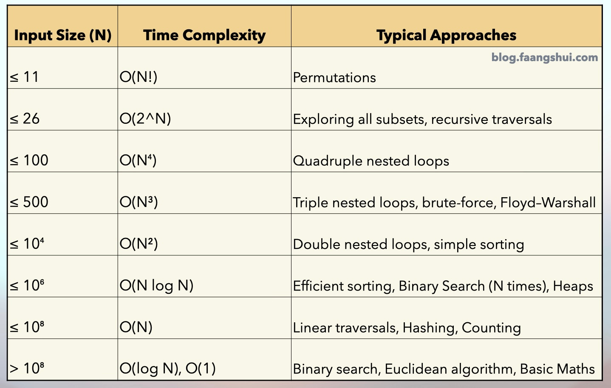

# This is my leetcode

>The meaning of the repository existence is to track my leetcode progress and make my github active :)
Current Progress:

[DSA Method](https://leetcode.com/problems/split-a-string-into-the-max-number-of-unique-substrings/editorial/#overview)

[Eulerian Path/Circuit algorithm](https://www.youtube.com/watch?v=8MpoO2zA2l4)
> This is the last HARD  problem in 2024 November, which requires the Eulerian Path/Circuit algorithm for the most optimal solution.

## last update: 2024/12/23