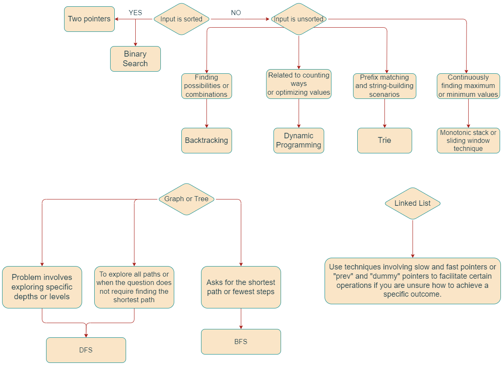

# This is my leetcode

>The meaning of the repository existence is to track my leetcode progress and make my github active :)
Current Progress:

[DSA Method](https://leetcode.com/problems/split-a-string-into-the-max-number-of-unique-substrings/editorial/#overview)

[Eulerian Path/Circuit algorithm](https://www.youtube.com/watch?v=8MpoO2zA2l4)
> This is the last HARD  problem in 2024 November, which requires the Eulerian Path/Circuit algorithm for the most optimal solution.

[01 BFS](https://cp-algorithms.com/graph/01_bfs.html)
> This is the first HARD that I encounter with 01 BFS.

[I JUST CANT](https://leetcode.com/problems/apply-operations-to-maximize-score/editorial/?envType=daily-question&envId=2025-03-29)

## last update: 2025/1/18